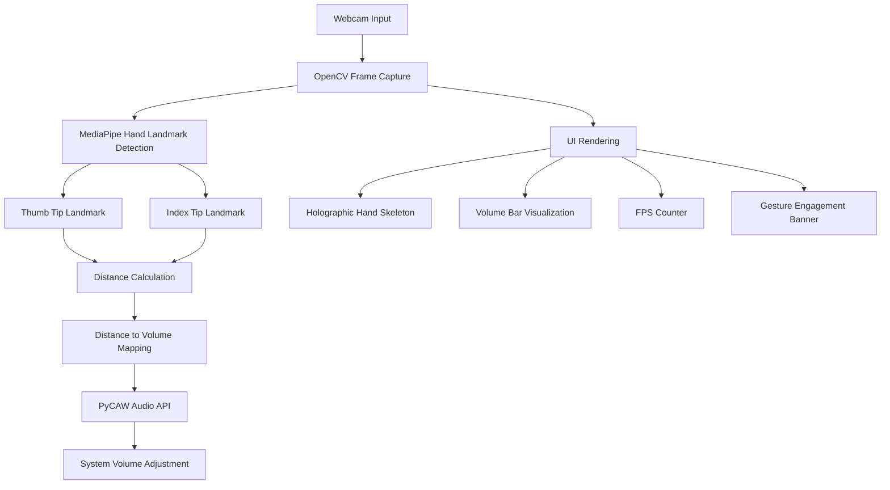

# 🖐 AirVolumeControl

### Touchless System Volume Control using Hand Gestures


---

## 📌 Overview

**AirVolumeControl** is a real-time gesture-based system that allows users to control their computer’s volume **without touching the keyboard or mouse**.

Using **MediaPipe hand tracking and OpenCV**, the program detects the distance between the **thumb and index finger** and dynamically maps it to the **system volume level**.

The project also includes a **futuristic holographic UI overlay**, making the interaction visually engaging and intuitive.

This project demonstrates concepts from **Computer Vision, Human–Computer Interaction (HCI), and real-time gesture recognition systems**.

---

## ✨ Features

* ✋ **Real-time hand tracking**
* 🎚 **Touchless volume control**
* 🎨 **Holographic hand skeleton visualization**
* 📊 **Dynamic gradient volume bar**
* ⚡ **Live FPS counter**
* 🟢 **Gesture engagement detection**
* 🧠 **Smooth volume interpolation**
* 🔄 **Automatic MediaPipe model download**

---

## 🧠 Technologies Used

* **Python**
* **OpenCV**
* **MediaPipe Tasks API**
* **NumPy**
* **PyCAW (Windows Audio Control API)**
* **Computer Vision**

---

## 🏗 System Architecture



---

## ⚙ Processing Pipeline


---

## 📂 Project Structure

```
AirVolumeControl/
│
├── AirVolumeControl.py
├── hand_landmarker.task
├── requirements.txt
├── README.md
```

---

## 💻 Requirements

* Python **3.8+**
* Webcam
* Windows OS (required for PyCAW audio control)

---

## 📦 Installation

### 1️⃣ Clone the repository

```bash
git clone https://github.com/kshitiz-arc/AirVolumeControl.git
cd AirVolumeControl
```

---

### 2️⃣ Install dependencies

```bash
pip install -r requirements.txt
```

---

### 3️⃣ Run the program

```bash
python AirVolumeControl.py
```

Press **Q** to exit.

---

## 🎮 Gesture Control

| Gesture                      | Action          |
| ---------------------------- | --------------- |
| Thumb and index finger close | Volume decrease |
| Thumb and index finger apart | Volume increase |

The system measures the **distance between finger landmarks** and maps it smoothly to the **system volume range**.

---

## 🔬 Future Improvements

Potential extensions include:

* Multi-gesture control system
* Gesture-based media playback control
* Cross-platform audio support (Linux / macOS)
* AI-based gesture classification
* Augmented reality interface overlays
* GPU acceleration for improved performance

---

## 📚 Applications

This project demonstrates ideas used in:

* Human Computer Interaction (HCI)
* Computer Vision Interfaces
* Gesture Recognition Systems
* Smart Environment Control
* Contactless Interaction Systems

---

## 👨‍💻 Author

**Kshitiz**

Mathematics Graduate
Computer Vision Enthusiast
Research Developer

GitHub: https://github.com/kshitiz-arc

---

## ⭐ Support

If you find this project interesting, consider **starring the repository**.

---

## 📜 License

This project is released under the **MIT License**.
